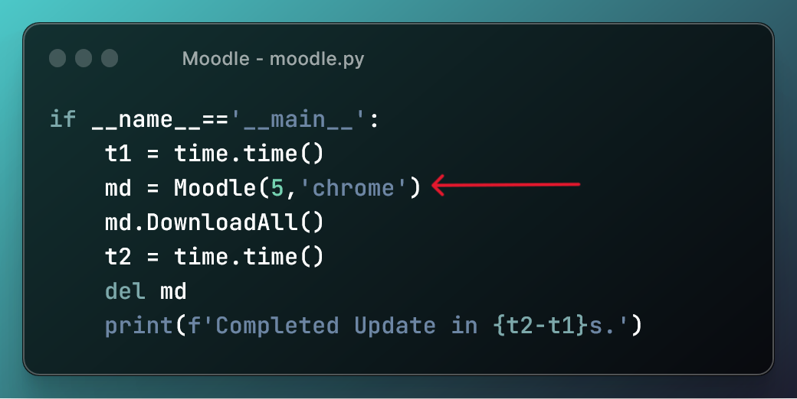

# Local Moodle
---

The Moodle Scraper is a Python script that allows you to automate the process of downloading files and posts from Moodle courses. This script is designed to work with the current Moodle verson used at the Indian Institute of Technology Bombay (IITB), and Firefox as browser.

## Table of Contents
- [Requirements](#requirements)
- [Usage](#usage)
- [Configuration](#configuration)    
    - [Firefox](firefox.md)
    - [Chrome](chrome.md)
- [How It Works](#how-it-works)
- [Contributing](#contributing)

## Requirements

Before using the Moodle Scraper, ensure you have the following dependencies installed:
- Python 3.x
- Required Python packages (install using `pip`):
  - `requests`
  - `BeautifulSoup`
  - `selenium`
  - `webdriver_manager`
-  Specific versions are listed in `requirements.txt`.

## Usage

1. Clone this repository to your local machine.
2. Install the required packages by executing the following command in your terminal.
    ```bash
    pip intsll -r requirements.txt
    ```

3. Modify the `config.json` file as described in [Configuration](#configuration).

4. In moodle.py update the semNo and browser you want to use.
    

4. Run the script by executing the following command in your terminal:

   ```bash
   python moodle.py
   ```
    The script will log in to your Moodle account, download course materials, and scrape forum posts.

## Configuration

The config.json file contains configuration settings for the browser preferences. You should modify this file to match your specific setup.

Set up your browser.

- [Firefox](firefox.md)
- [Chrome](chrome.md)

## How It Works

1. The script uses Selenium and WebDriver to automate browser actions, such as logging in to Moodle.

2. It scrapes course information from your Moodle homepage and creates folders for each course in a specified directory (e.g., ./Sem5).

3. It downloads course materials (PDFs) that haven't been downloaded before and saves them in the corresponding course folders.

4. It scrapes forum posts and downloads any attachments associated with them.

## Contributing

Feel free to contribute to this project by opening issues or submitting pull requests. Your contributions are welcome
