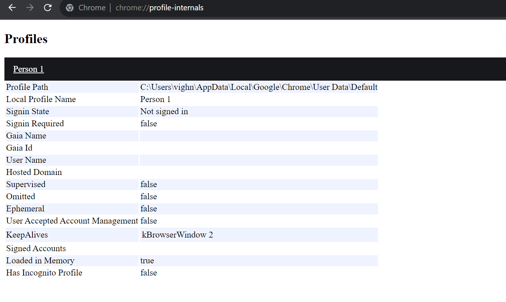

# Local Moodle
---

# For using Local Moodle with Chrome follow following steps and update config.json file.

1. Make sure you have saved your login details (remember me on this device) in Firefox browser.

    It should look something like this.
    

2. Go to `chrome://profile-internals` in Chrome and note down the profile location.

3. Go to the `User Data` folder of Chrome(`C:\\Users\\*userName*\\AppData\\Local\\Google\\Chrome\\User Data\\`) and create a copy of the the Profile that you saw in previous step.

4. Open Google and search for `my user-agent` in Chrome and copy the result.

5. Modify the `config.json` file to include the location of `User Data` folder for `user-data-dir`, the copied profile name for `profile` and user-agent under `chrome`.
