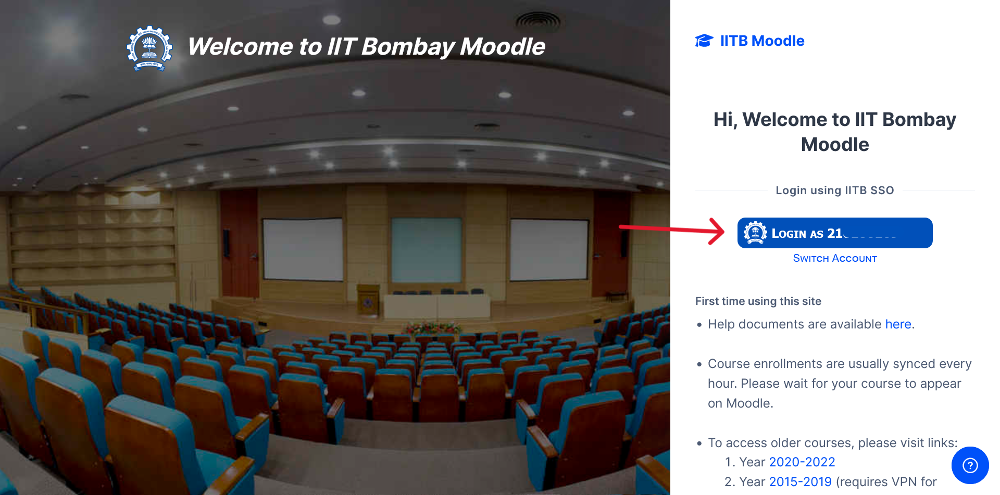
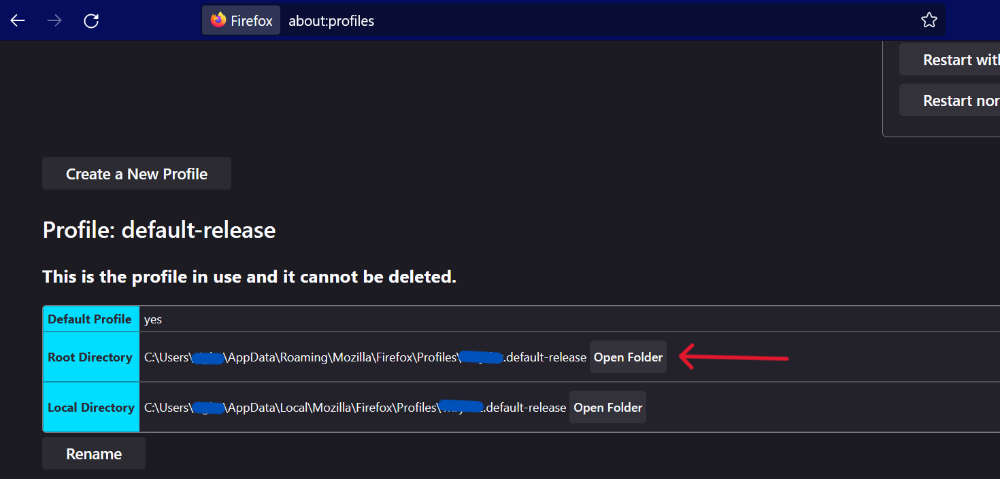

# Local Moodle
---

# For using Local Moodle with Firefox follow following steps and update config.json file.

1. Make sure you have saved your login details (remember me on this device) in Firefox browser.

    It should look something like this.
    

2. Go to `about:profiles` in Firefox and note down the profile location.

3. Go to the Profiles folder of Firefox(`C:\\Users\\*username*\\AppData\\Roaming\\Mozilla\\Firefox\\Profiles\\`) and create a copy of the the Profile that you saw in previous step.

4. Open Google and search for `my user-agent` in Firefox and copy the result.

5. Modify the `config.json` file to include the location of the copied profile and user-agent under `firefox`.
